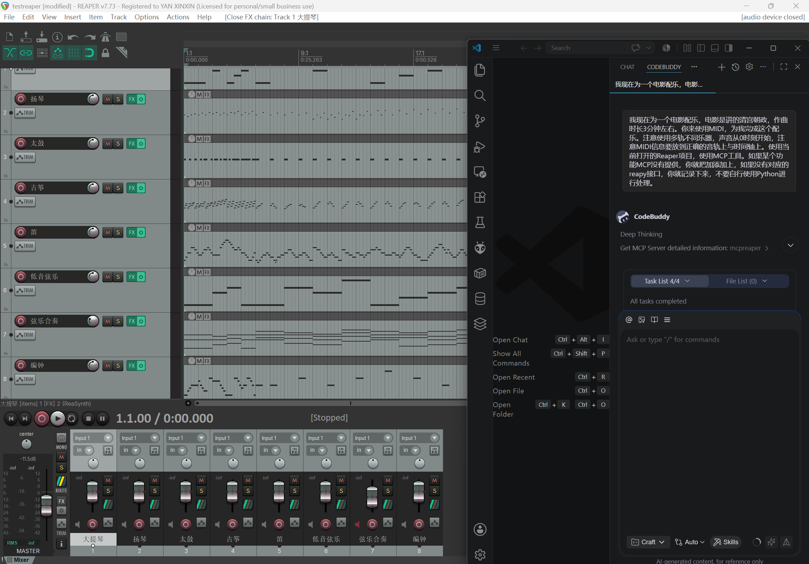

# MCP Reaper (mcpreaper)

面向 Reaper 的 MCP 服务端，当前只保留一条稳定连接路径：

1. 在 Reaper 中执行 Action：`enable_reapy_server.lua`
2. Web Interface 监听端口固定为 `2307`
3. MCP 通过本机 IPv4 + `2307` 连接 Reaper

## 首页资源（测试工程）

当前仓库内置了测试工程渲染资源（3分钟清朝背景音乐）：

- 工程文件：`ReaperProject/testreaper.rpp`
- 音频文件：`ReaperProject/testreaper.wav`
- 配图文件：`ReaperProject/testmcp.png`



<audio controls src="ReaperProject/testreaper.wav"></audio>

如果浏览器不支持上面的播放器，可直接下载：
[testreaper.wav](ReaperProject/testreaper.wav)

## 环境要求

- Python 3.11
- REAPER 7.x
- 已在 REAPER 中启用 Python ReaScript

## 安装

```powershell
py -3.11 -m venv .venv
.\.venv\Scripts\python.exe -m pip install -r requirements.txt
```

## Reaper 配置（仅 2307）

### 1) 在 Reaper 启用 Python ReaScript

路径：`Options -> Preferences -> Plug-ins -> ReaScript`

- 勾选 `Enable Python for use with ReaScript`
- Python DLL 目录指向包含 `python311.dll` 的目录

### 2) 启用 reapy server Action

在 Reaper 执行：

1. `Actions -> Show action list...`
2. `ReaScript: Load script...`
3. 加载并运行：`scripts/enable_reapy_server.lua`

该 Action 会将 Web Interface 绑定到 `2307`，并写入 reapy 所需状态。

### 3) 验证 Web 监听

在本机浏览器访问：

```text
http://<本机IPv4>:2307/
```

看到 `REAPER control` 页面即表示监听正常。

## 启动 MCP

```powershell
.\.venv\Scripts\python.exe .\main.py
```

服务通过 `stdio` 工作，供支持 MCP 的客户端调用。

## VS Code 任务

- `mcpreaper: install deps (.venv)`
- `mcpreaper: run server`
- `mcpreaper: check reaper connection`
- `mcpreaper: check web 2307`
- `mcpreaper: activate reapy server instructions`

## 项目说明

- 已清理旧测试产物与无用测试脚本
- 已替换 `ReaperProject` 为桌面 `testreaper` 测试工程
- 文档中移除了旧的多端口/多回退配置说明，仅保留 `2307`
